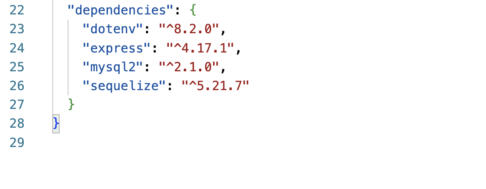

# e-commerce-backend

##  Description
This application uses express and mysql for the backend of this e-commerce site. There are 3 different routes that you can see tested in the video walkthrough. These are the "categories" route, "products" route, and "tags" route. 

##  Table of Contents
* [Installation](#installation)
* [Usage](#usage)
* [License](#license)
* [Contributing](#contributing)
* [Questions](#questions)

##  Installation
Express and mysql must be installed to run the backend on this e-commerce site.  

##  Usage
Here is a [Video Walkthrough](https://watch.screencastify.com/v/EYJDa1xwXUDbD5FaFX8x) of how this application can be used. 

## License
This is licensed under the MIT license.

##  Contributing
[w3schools](https://www.w3schools.com/) 
[Stack Overflow](https://stackoverflow.com/?newreg=8cd9776f072c449eac02d1ab363597c8)

##  Questions
If you have any questions about the repo, feel free to email me at chelseaburnham0@gmail.com. You can find more of my work at [http://github.com/chelseaburnham].